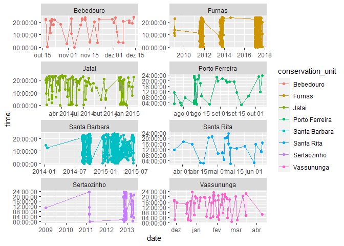

<!-- README.md is generated from README.Rmd. Please edit that file -->

# Behavioral effects of dog activity

## Load Packages

``` r
library(tidyverse)
library(lubridate)
library(readr)
library(stringr)
```

## Data input

``` r
data_set <- read_rds("data/my_data_set_2.rds")
data_set <- data_set |> 
  mutate(
    species = ifelse(species == "Dasypsu", "Dasypus", species),
    conservation_unit = ifelse(str_detect(conservation_unit,"Furnas"),"Furnas",conservation_unit)
  )
glimpse(data_set)
#> Rows: 3,417
#> Columns: 9
#> $ conservation_unit <chr> "Bebedouro", "Bebedouro", "Bebedouro", "Bebedouro", ~
#> $ species           <chr> "Dasypus", "Dasypus", "Dasypus", "Dasypus", "Dasypus~
#> $ station           <chr> "183", "186", "183", "183", "183", "184", "186", "18~
#> $ date              <date> 2014-11-05, 2014-10-18, 2014-12-04, 2014-12-07, 201~
#> $ time              <time> 00:02:29, 00:12:24, 04:00:20, 03:33:39, 21:10:36, 2~
#> $ mestre            <lgl> FALSE, FALSE, FALSE, FALSE, FALSE, FALSE, FALSE, FAL~
#> $ day               <dbl> 5, 18, 4, 7, 11, 17, 7, 13, 14, 17, 18, 20, 21, 23, ~
#> $ month             <dbl> 11, 10, 12, 12, 12, 10, 12, 12, 12, 10, 10, 10, 10, ~
#> $ year              <dbl> 2014, 2014, 2014, 2014, 2014, 2014, 2014, 2014, 2014~
```

## identifying points with `m/e` cameras and setting the `date_time`

``` r
data_set <- data_set |> 
  mutate(
   m_e= str_detect(station, "\\(m/e\\)"),
   station = str_remove(station, "\\(m/e\\)"),
   station = ifelse(station == "NA", NA, as.numeric(station)),
   date_time = ymd_hms(paste(date, time))
   )
glimpse(data_set)
#> Rows: 3,417
#> Columns: 11
#> $ conservation_unit <chr> "Bebedouro", "Bebedouro", "Bebedouro", "Bebedouro", ~
#> $ species           <chr> "Dasypus", "Dasypus", "Dasypus", "Dasypus", "Dasypus~
#> $ station           <dbl> 183, 186, 183, 183, 183, 184, 186, 186, 186, 186, 18~
#> $ date              <date> 2014-11-05, 2014-10-18, 2014-12-04, 2014-12-07, 201~
#> $ time              <time> 00:02:29, 00:12:24, 04:00:20, 03:33:39, 21:10:36, 2~
#> $ mestre            <lgl> FALSE, FALSE, FALSE, FALSE, FALSE, FALSE, FALSE, FAL~
#> $ day               <dbl> 5, 18, 4, 7, 11, 17, 7, 13, 14, 17, 18, 20, 21, 23, ~
#> $ month             <dbl> 11, 10, 12, 12, 12, 10, 12, 12, 12, 10, 10, 10, 10, ~
#> $ year              <dbl> 2014, 2014, 2014, 2014, 2014, 2014, 2014, 2014, 2014~
#> $ m_e               <lgl> FALSE, FALSE, FALSE, FALSE, FALSE, FALSE, FALSE, FAL~
#> $ date_time         <dttm> 2014-11-05 00:02:29, 2014-10-18 00:12:24, 2014-12-0~
```

# Quick view of ‘capture’ frequency

``` r
data_set |> 
  ggplot(aes(x=date,y=time,color=conservation_unit)) +
  geom_line() + 
  geom_point() +
  facet_wrap(~conservation_unit, scale="free", nrow = 5)
```

<!-- -->

# Identify the pray and predator

``` r
pray <- c("Dasypus", "Cabassous", "Euphractus")
data_set <- data_set |> 
  mutate(
    type = ifelse(species %in% pray, "pray", "predator")
  )
glimpse(data_set)
#> Rows: 3,417
#> Columns: 12
#> $ conservation_unit <chr> "Bebedouro", "Bebedouro", "Bebedouro", "Bebedouro", ~
#> $ species           <chr> "Dasypus", "Dasypus", "Dasypus", "Dasypus", "Dasypus~
#> $ station           <dbl> 183, 186, 183, 183, 183, 184, 186, 186, 186, 186, 18~
#> $ date              <date> 2014-11-05, 2014-10-18, 2014-12-04, 2014-12-07, 201~
#> $ time              <time> 00:02:29, 00:12:24, 04:00:20, 03:33:39, 21:10:36, 2~
#> $ mestre            <lgl> FALSE, FALSE, FALSE, FALSE, FALSE, FALSE, FALSE, FAL~
#> $ day               <dbl> 5, 18, 4, 7, 11, 17, 7, 13, 14, 17, 18, 20, 21, 23, ~
#> $ month             <dbl> 11, 10, 12, 12, 12, 10, 12, 12, 12, 10, 10, 10, 10, ~
#> $ year              <dbl> 2014, 2014, 2014, 2014, 2014, 2014, 2014, 2014, 2014~
#> $ m_e               <lgl> FALSE, FALSE, FALSE, FALSE, FALSE, FALSE, FALSE, FAL~
#> $ date_time         <dttm> 2014-11-05 00:02:29, 2014-10-18 00:12:24, 2014-12-0~
#> $ type              <chr> "pray", "pray", "pray", "pray", "pray", "pray", "pra~
```

# Calculating the time

``` r
data_set_aux <- data_set |> 
  arrange(conservation_unit, mestre, station, date_time)

data_set_aux$diff_time <- NA
for(i in 1:(nrow(data_set_aux)-1)){
  unit_con <- data_set_aux$conservation_unit[i]
  mestre <- data_set_aux$mestre[i]
  station <- data_set_aux$station[i]
  if((unit_con == data_set_aux$conservation_unit[i+1] &
     mestre == data_set_aux$mestre[i+1] &
      station == data_set_aux$station[i+1]) | is.na(data_set_aux$station[i+1]) ){
    if(data_set_aux$type[i] == "predator" & 
       data_set_aux$type[i+1] == "pray"){
      data_set_aux$diff_time[i] =  as.numeric(
        difftime(
          data_set_aux$date_time[i+1], data_set_aux$date_time[i],units = "hours"))
       }
  }else{
        data_set_aux$diff_time[i] <- NA
      }
}
writexl::write_xlsx(data_set_aux,"data/banco_de_dados.xlsx")
```

## The same approch for the new data

## Data input

``` r
data_set <- read_rds("data/my_data_set_novo.rds")
data_set <- data_set |> 
  mutate(
    species = ifelse(species == "Dasypsu", "Dasypus", species),
    conservation_unit = ifelse(str_detect(conservation_unit,"Furnas"),"Furnas",conservation_unit)
  )
glimpse(data_set)
#> Rows: 3,951
#> Columns: 9
#> $ conservation_unit <chr> "Bebedouro", "Bebedouro", "Bebedouro", "Bebedouro", ~
#> $ species           <chr> "Dasypus", "Dasypus", "Dasypus", "Dasypus", "Dasypus~
#> $ station           <chr> "183", "186", "183", "183", "183", "184", "186", "18~
#> $ date              <date> 2014-11-05, 2014-10-18, 2014-12-04, 2014-12-07, 201~
#> $ time              <time> 00:02:29, 00:12:24, 04:00:20, 03:33:39, 21:10:36, 2~
#> $ mestre            <lgl> FALSE, FALSE, FALSE, FALSE, FALSE, FALSE, FALSE, FAL~
#> $ day               <dbl> 5, 18, 4, 7, 11, 17, 7, 13, 14, 17, 18, 20, 21, 23, ~
#> $ month             <dbl> 11, 10, 12, 12, 12, 10, 12, 12, 12, 10, 10, 10, 10, ~
#> $ year              <dbl> 2014, 2014, 2014, 2014, 2014, 2014, 2014, 2014, 2014~
```

## identifying points with `m/e` cameras and setting the `date_time`

``` r
data_set <- data_set |> 
  mutate(
   m_e= str_detect(station, "\\(m/e\\)"),
   station = str_remove(station, "\\(m/e\\)"),
   station = ifelse(station == "NA", NA, as.numeric(station)),
   date_time = ymd_hms(paste(date, time))
   )
glimpse(data_set)
#> Rows: 3,951
#> Columns: 11
#> $ conservation_unit <chr> "Bebedouro", "Bebedouro", "Bebedouro", "Bebedouro", ~
#> $ species           <chr> "Dasypus", "Dasypus", "Dasypus", "Dasypus", "Dasypus~
#> $ station           <dbl> 183, 186, 183, 183, 183, 184, 186, 186, 186, 186, 18~
#> $ date              <date> 2014-11-05, 2014-10-18, 2014-12-04, 2014-12-07, 201~
#> $ time              <time> 00:02:29, 00:12:24, 04:00:20, 03:33:39, 21:10:36, 2~
#> $ mestre            <lgl> FALSE, FALSE, FALSE, FALSE, FALSE, FALSE, FALSE, FAL~
#> $ day               <dbl> 5, 18, 4, 7, 11, 17, 7, 13, 14, 17, 18, 20, 21, 23, ~
#> $ month             <dbl> 11, 10, 12, 12, 12, 10, 12, 12, 12, 10, 10, 10, 10, ~
#> $ year              <dbl> 2014, 2014, 2014, 2014, 2014, 2014, 2014, 2014, 2014~
#> $ m_e               <lgl> FALSE, FALSE, FALSE, FALSE, FALSE, FALSE, FALSE, FAL~
#> $ date_time         <dttm> 2014-11-05 00:02:29, 2014-10-18 00:12:24, 2014-12-0~
```

# Quick view of ‘capture’ frequency

``` r
data_set |> 
  ggplot(aes(x=date,y=time,color=conservation_unit)) +
  geom_line() + 
  geom_point() +
  facet_wrap(~conservation_unit, scale="free", nrow = 5)
```

<!-- -->

# Identify the pray and predator

``` r
pray <- c("Dasypus", "Cabassous", "Euphractus")
predators <- c("Cfamiliaris", "Lpardalis", "Cbrachyurus", "Pconcolor")
data_set <- data_set |> 
  mutate(
    type = ifelse(species %in% pray, "pray", "predator")
  )
```

``` r
data_set <- data_set |> 
  filter(species != "Mtridactyla")   
glimpse(data_set)
#> Rows: 1,897
#> Columns: 12
#> $ conservation_unit <chr> "Bebedouro", "Bebedouro", "Bebedouro", "Bebedouro", ~
#> $ species           <chr> "Dasypus", "Dasypus", "Dasypus", "Dasypus", "Dasypus~
#> $ station           <dbl> 183, 186, 183, 183, 183, 184, 186, 186, 186, 186, 18~
#> $ date              <date> 2014-11-05, 2014-10-18, 2014-12-04, 2014-12-07, 201~
#> $ time              <time> 00:02:29, 00:12:24, 04:00:20, 03:33:39, 21:10:36, 2~
#> $ mestre            <lgl> FALSE, FALSE, FALSE, FALSE, FALSE, FALSE, FALSE, FAL~
#> $ day               <dbl> 5, 18, 4, 7, 11, 17, 7, 13, 14, 17, 18, 20, 21, 23, ~
#> $ month             <dbl> 11, 10, 12, 12, 12, 10, 12, 12, 12, 10, 10, 10, 10, ~
#> $ year              <dbl> 2014, 2014, 2014, 2014, 2014, 2014, 2014, 2014, 2014~
#> $ m_e               <lgl> FALSE, FALSE, FALSE, FALSE, FALSE, FALSE, FALSE, FAL~
#> $ date_time         <dttm> 2014-11-05 00:02:29, 2014-10-18 00:12:24, 2014-12-0~
#> $ type              <chr> "pray", "pray", "pray", "pray", "pray", "pray", "pra~
```

# Calculating the time

``` r
data_set_aux <- data_set |> 
  arrange(conservation_unit, mestre, station, date_time)

data_set_aux$diff_time <- NA
for(i in 1:(nrow(data_set_aux)-1)){
  unit_con <- data_set_aux$conservation_unit[i]
  mestre <- data_set_aux$mestre[i]
  station <- data_set_aux$station[i]
  if((unit_con == data_set_aux$conservation_unit[i+1] &
     mestre == data_set_aux$mestre[i+1] &
      station == data_set_aux$station[i+1]) | is.na(data_set_aux$station[i+1]) ){
    if(data_set_aux$type[i] == "predator" & 
       data_set_aux$type[i+1] == "pray"){
      data_set_aux$diff_time[i] =  as.numeric(
        difftime(
          data_set_aux$date_time[i+1], data_set_aux$date_time[i],units = "hours"))
       }
  }else{
        data_set_aux$diff_time[i] <- NA
      }
}
writexl::write_xlsx(data_set_aux,"data/banco_de_dados_novo.xlsx")
```

# Calculating the time without multiple predator effect.

``` r
# data_set_aux <- data_set |> 
#   arrange(conservation_unit, mestre, station, date_time)
# units <- data_set_aux |> pull(conservation_unit) |>  unique()
# for(i in seq_along(units)){
#   df <- data_set_aux |> 
#     filter(conservation_unit == units[i]) 
#   stations <-  df |>  pull(station) |>  unique()
#   for(j in seq_along(stations)){
#     dff <- df |> 
#       filter(station == stations[j])
#     # Agora vamos validar
#     n_pray <- sum(dff |> pull(type) == "pray")
#     n_pradator <- sum(dff |> pull(type) == "predator")
#     if(n_pray != 0 & nrow(dff) >1){
#       for(k in 2:nrow(dff)){
#         if(dff$type[k] =="pray"){ # se verdadeiro eu valido
#           cont = 0
#           for(l in (k-1):2){
#             if(dff$species[l] != dff$species[l-1]) cont = cont +1  # contar
#           }
#         }
#       }
# 
#     }
#   }
# }

# writexl::write_xlsx(data_set_aux,"data/banco_de_dados_novo_2.xlsx")
```
